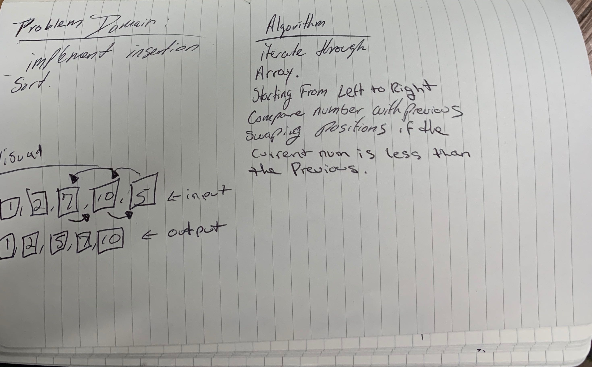
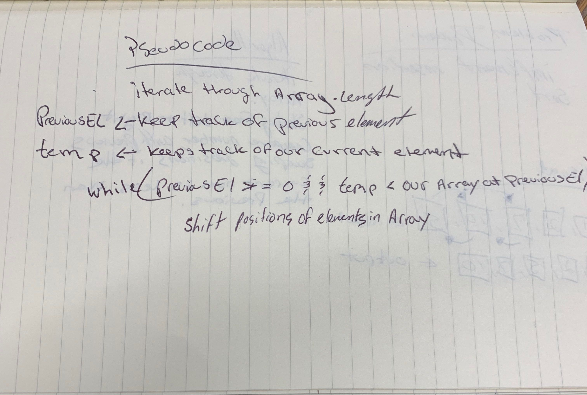
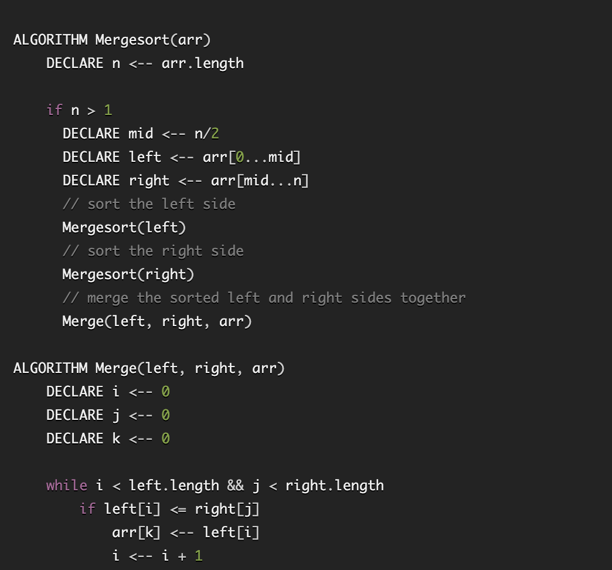
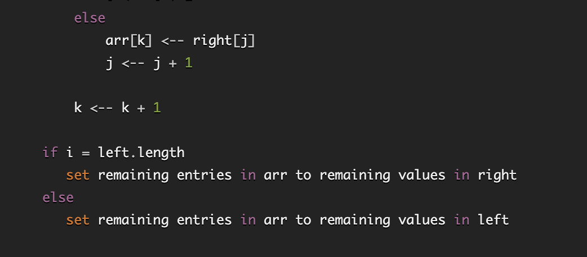
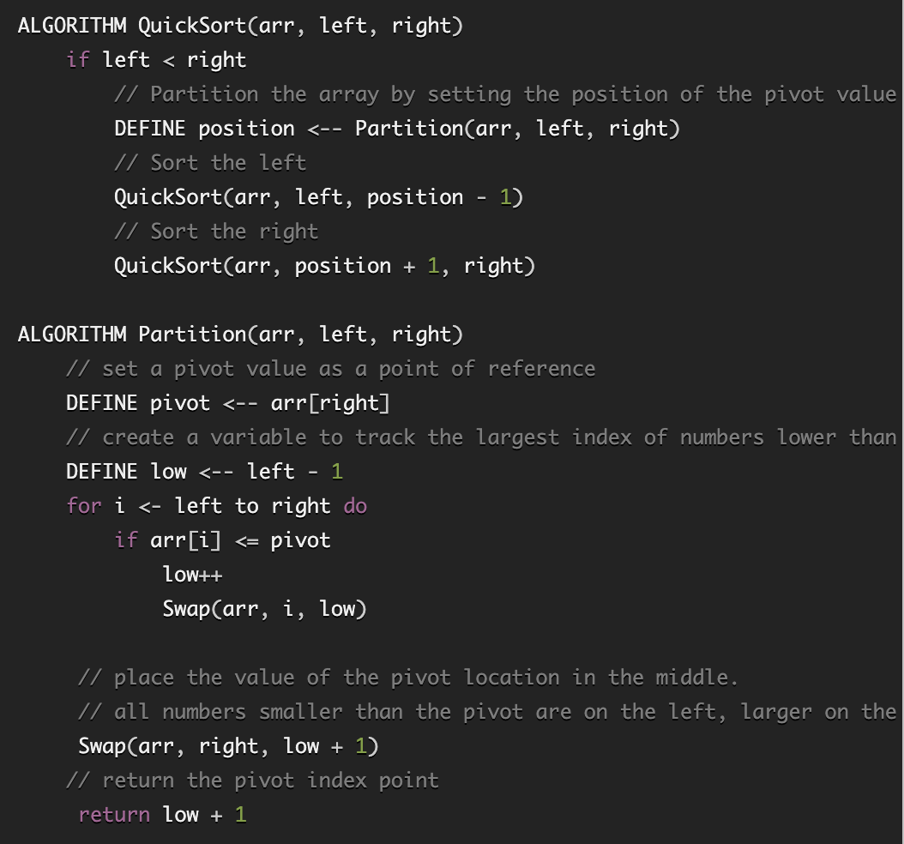
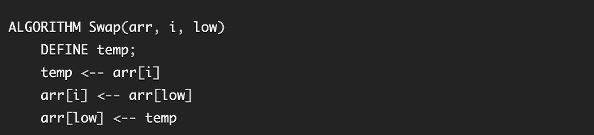

## Blog Notes 1: Insertion Sort
Insertion sort is a sorting algorithm. It can best be illustrated and described like sorting a hand of cards that
are laying face down on a table and you're sorting them as you place them on your hand ensuring the smallest card is on 
the leftmost place. 

## Learning Objectives
* Learn the insertion sorting algorithm 
* Implement the insertion sorting algorithm
* Time/Space Complexity of insertion sort

## Information Flow
* Benefit : Best for smaller inputs
* Input : Unsorted array of integers -> [1,7,5,4]
* Output : Sorted Array -> [1,4,5,7]
* Time : O(n^2)
* Space : O(1)

## Diagram 

## Algorithm
* Iterate through array.
* If it's the first element it is already sorted (keep track of previous element)
* Select the next element
* Compare all elements in the array 
* Swap positions if the current element is less than the previous element
* Repeat until array is fully sorted.

## Pseudocode

## Readings & References 
[Video Walkthrough](https://www.youtube.com/watch?v=JU767SDMDvA)

[Blog Post Tutorial](https://medium.com/karuna-sehgal/an-introduction-to-insertion-sort-16b97619697)

___

## Blog Notes 2: Merge Sort
A divide and conquer algorithm that splits an array into two halves and the function calls itself (recursion) to merge the
two halves. 

## Learning Objectives
* Learn the merge sort algorithm 
* Implement the merge sort algorithm
* Time/Space Complexity of merge sort

## Information Flow
* Time : O(n log n)
* Space : O(n)

## Diagram 

## Pseudocode
Provided by CodeFellows

## Readings & References 
[Merge Sort Resource 1](https://www.tutorialspoint.com/data_structures_algorithms/merge_sort_algorithm.htm)  
[Merge Sort Resource 2](https://www.geeksforgeeks.org/merge-sort/)  
[Merge Sort Resource 3](https://howtodoinjava.com/algorithm/merge-sort-java-example/)  
[Video Walkthrough](https://www.youtube.com/watch?v=4VqmGXwpLqc)

## Blog Notes 3: Quick Sort
Like Merge Sort, QuickSort is a Divide and Conquer algorithm. 
It picks an element as pivot and partitions the given array around the picked pivot.

## Learning Objective
* Learn the quick sort algorithm 
* Implement the quick sort algorithm
* Time/Space Complexity of quick sort

## Information Flow
* Time : O(n^2)
* Space : O(log n)

## Diagram

## Pseudocode

## Readings & References
[Quick Sort Resource 1](https://en.wikipedia.org/wiki/Quicksort)  
[Quick Sort Resource 2](https://www.geeksforgeeks.org/quick-sort/)  
[Video Resource](https://www.youtube.com/watch?v=SLauY6PpjW4)  

