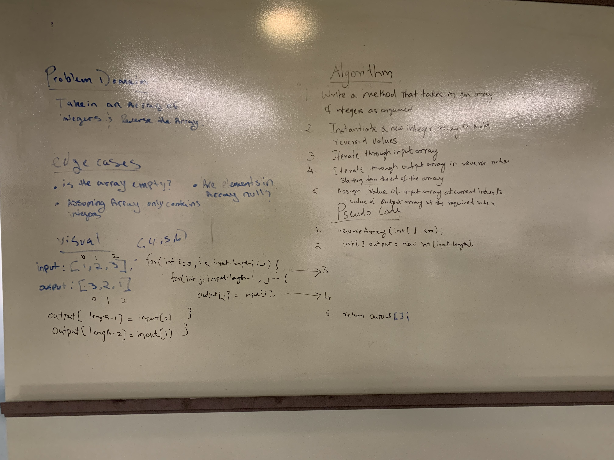
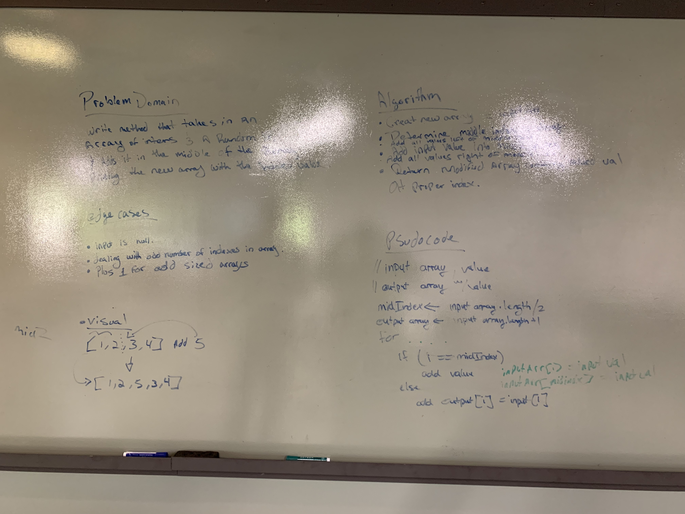
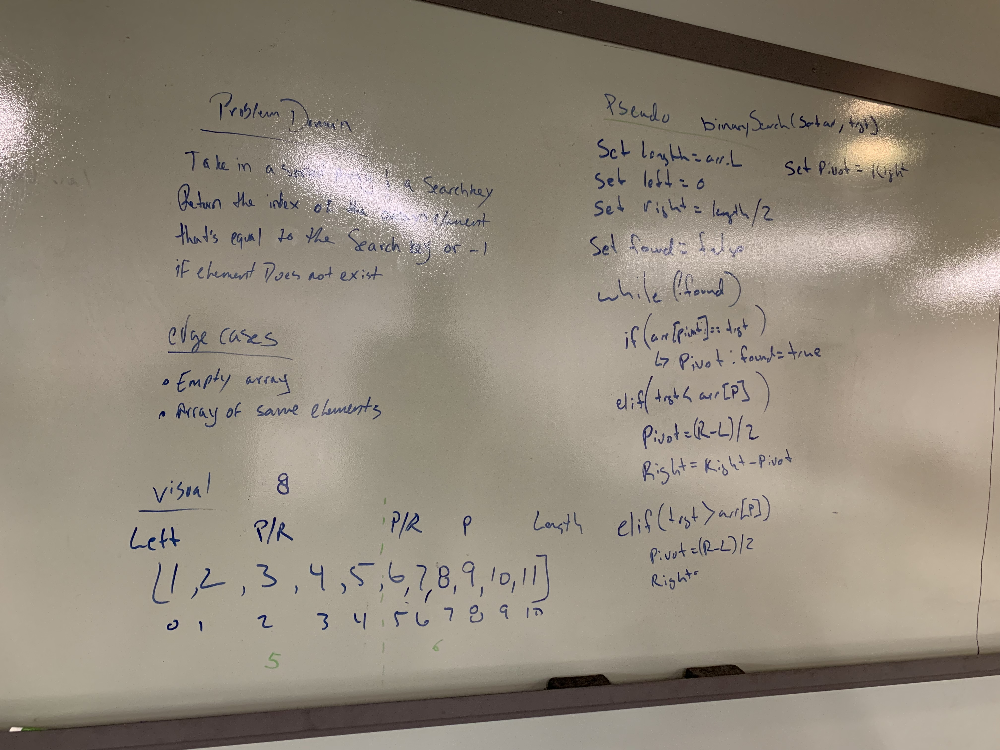
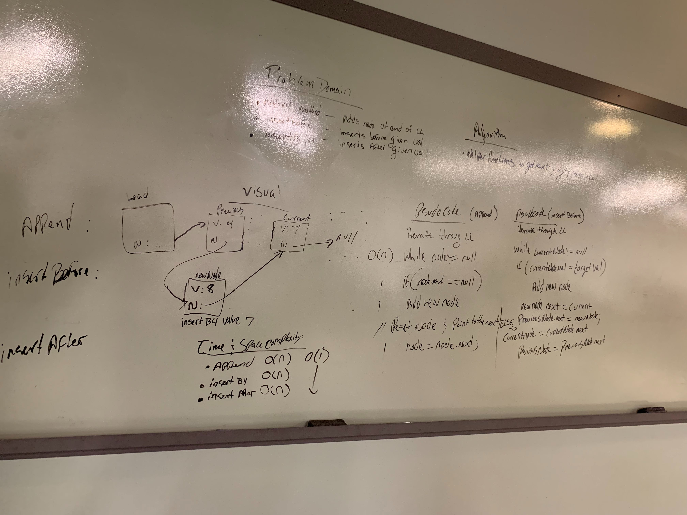

# Code Challenge 01 : Reverse an Array
A short Java program that reverses an array.

## Challenge
The challenge was to define a method which takes in an array of integers and returns that array in descending order.

## Approach & Efficiency
- [x] Write a method that takes in an array of integers as argument
- [x] Instantiate a new array of integers to hold our reversed values
- [x] iterate through input array in reverse order with reverse for loop
- [x] assign reversed values into output Array at the reversed index subtracted by i
- [x] return output array  

## Collaborative Efforts
Padmapriya Ganapathi

## Solution

# Code Challenge 02 : Shift Array

## Challenge
Write a function called insertShiftArray which takes in an array and the value to be added.
Without utilizing any of the built-in methods available to your language, return an array with the new value added at the middle index.

## Approach & Efficiency
- [x] Create new Array that can hold the old array plus the intended added element
- [x] Create new variable to keep track of indexes.
- [x] Determine middle index that the new element will be added to
- [x] Iterate through input array
- [x] Check when the index of the array is at our target index
- [x] Insert new element
- [x] Increment index variable
- [x] Assign old array to the new array at the index outlined by our countOfIndex variable.
- [x] Increment index variable
- [x] Return new Array

## Collaborative Efforts
Matt Stuhring  
Peter Lee

## Solution

# Code Challenge 03 : Binary Search

## Challenge
Write a function called BinarySearch which takes in 2 parameters: a sorted array and the search key. 
Without utilizing any of the built-in methods available to your language, return the index of the array’s 
element that is equal to the search key, or -1 if the element does not exist.

## Approach & Efficiency
- [x] Write a function that takes in the sorted array and the search key.
- [x] Create variables to keep track of min index, max index and the midpoint which is the length of array / 2
- [x] Make a comparison starting at the midpoint and cut the size of the array depending on the value of the key
- [x] return the index of the element which contains our key
- [x] return -1 is element does not exist

## Collaborative Efforts
Travis Cox  

## Solution

# Code Challenge 06 : Linked list Insertions

## Challenge
Write the following methods for the Linked List class:

* .append(value) which adds a new node with the given value to the end of the list
* .insertBefore(value, newVal) which add a new node with the given newValue immediately before the first value node
* .insertAfter(value, newVal) which add a new node with the given newValue immediately after the first value node

## Approach & Efficiency
O(n) time complexity for this data structure with O(1) space.

## Collaborative Efforts
Kevin Couture  

## Solution

