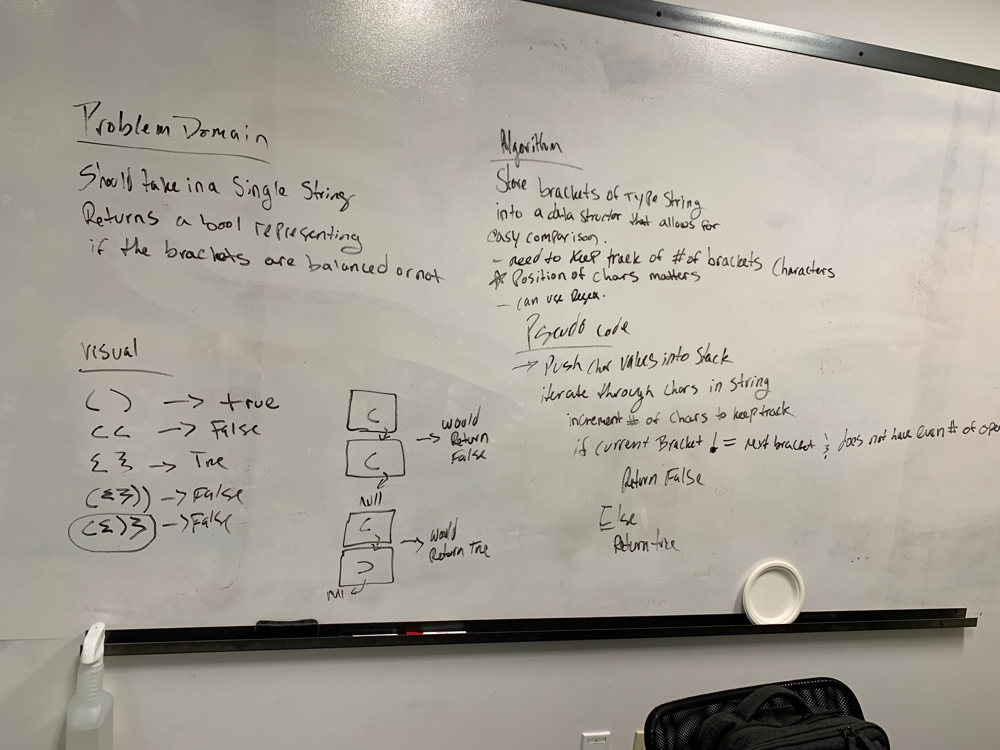
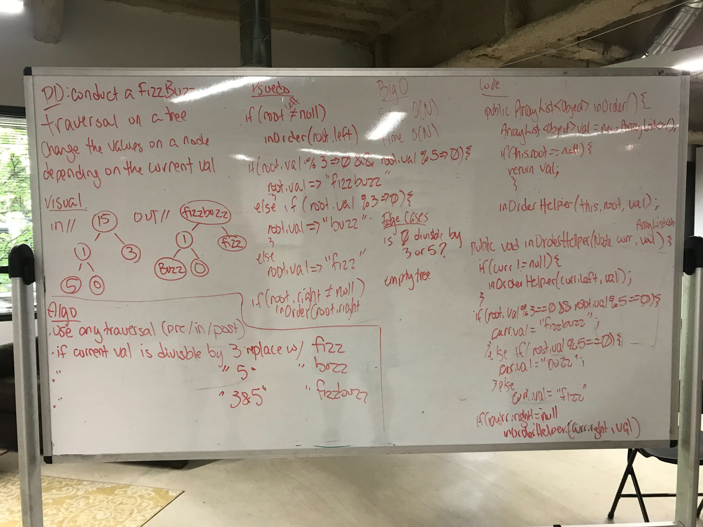
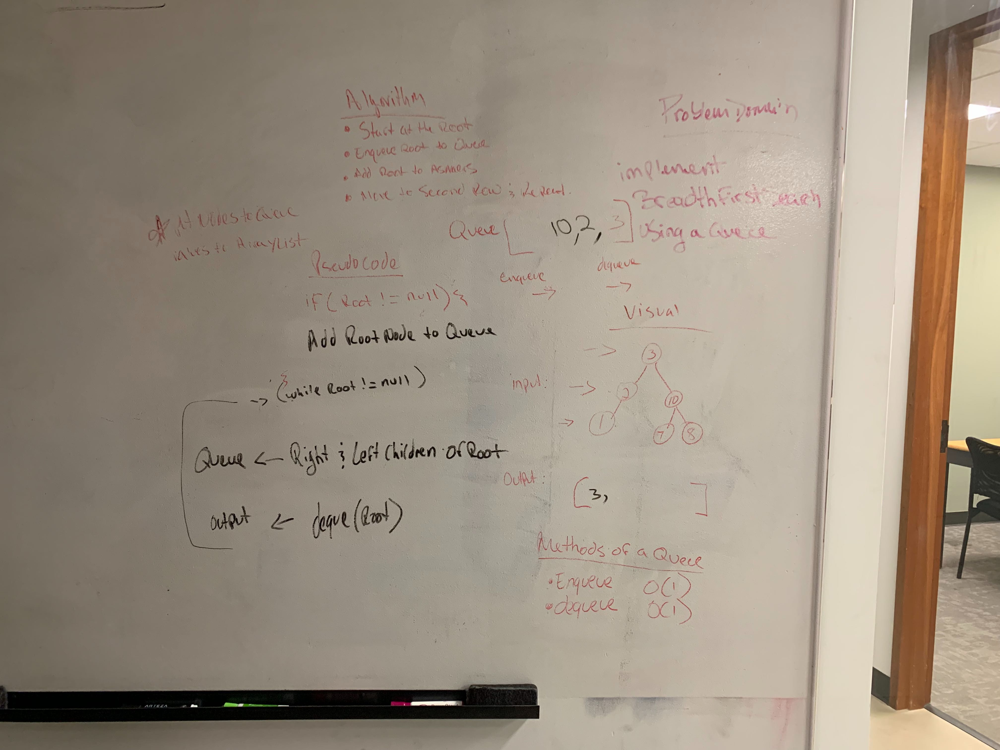
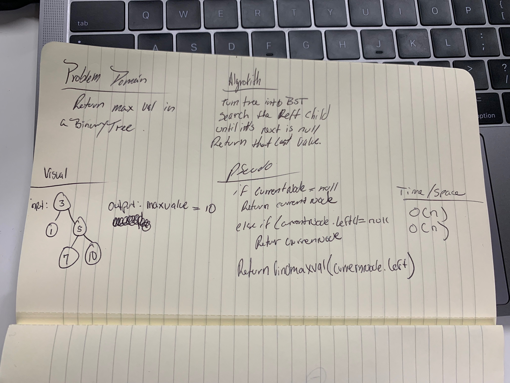
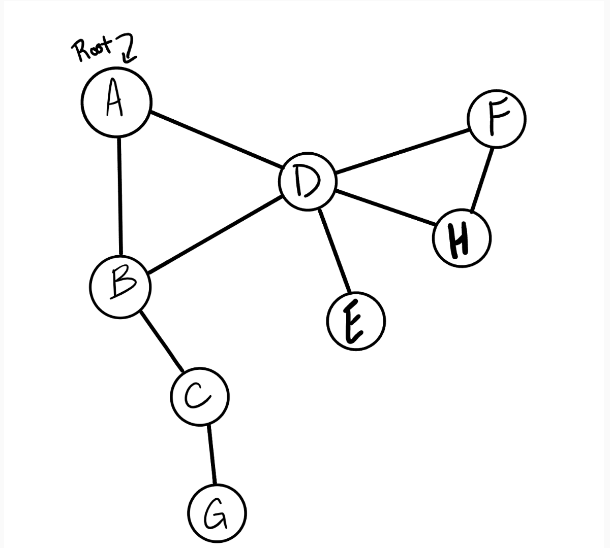

## Table of Contents

[Reverse an Array](#Reverse-an-Array) 
[Shift Array](#Shift-Array) 
[Binary Search](#Binary-Search) 
[Linked list Insertions](#Linked-list-Insertions) 
[Linked list k-th position from end Insertion](#Linked-list-k-th-position-from-end-Insertion) 
[Merging two Linked Lists](#Merging-two-Linked-Lists) 
[Implement a Queue With Two Stacks](Implement-a-Queue-With-Two-Stacks) 
[FIFO Animal Shelters](#FIFO-Animal-Shelter) 
[Multi-bracket Validation](#Multi-bracket-Validation) 
[FizzBuzz](#FizzBuzz) 
[BFT Binary Tree](#BFT-Binary-Tree) 
[Max in Binary Tree](#Max-in-Binary-Tree) 
[Repeated Word](#Repeated-Word) 
[BFT Graph](#BFT-Graph) 

# Reverse an Array
A short Java program that reverses an array.

## Challenge
The challenge was to define a method which takes in an array of integers and returns that array in descending order.

## Approach & Efficiency
- [x] Write a method that takes in an array of integers as argument
- [x] Instantiate a new array of integers to hold our reversed values
- [x] iterate through input array in reverse order with reverse for loop
- [x] assign reversed values into output Array at the reversed index subtracted by i
- [x] return output array  

## Collaborative Efforts
Padmapriya Ganapathi

## Solution

# Shift Array

## Challenge
Write a function called insertShiftArray which takes in an array and the value to be added.
Without utilizing any of the built-in methods available to your language, return an array with the new value added at the middle index.

## Approach & Efficiency
- [x] Create new Array that can hold the old array plus the intended added element
- [x] Create new variable to keep track of indexes.
- [x] Determine middle index that the new element will be added to
- [x] Iterate through input array
- [x] Check when the index of the array is at our target index
- [x] Insert new element
- [x] Increment index variable
- [x] Assign old array to the new array at the index outlined by our countOfIndex variable.
- [x] Increment index variable
- [x] Return new Array

## Collaborative Efforts
Matt Stuhring  
Peter Lee

## Solution

# Binary Search

## Challenge
Write a function called BinarySearch which takes in 2 parameters: a sorted array and the search key. 
Without utilizing any of the built-in methods available to your language, return the index of the array’s 
element that is equal to the search key, or -1 if the element does not exist.

## Approach & Efficiency
- [x] Write a function that takes in the sorted array and the search key.
- [x] Create variables to keep track of min index, max index and the midpoint which is the length of array / 2
- [x] Make a comparison starting at the midpoint and cut the size of the array depending on the value of the key
- [x] return the index of the element which contains our key
- [x] return -1 is element does not exist

## Collaborative Efforts
Travis Cox  

## Solution

# Linked list Insertions

## Challenge
Write the following methods for the Linked List class:

* .append(value) which adds a new node with the given value to the end of the list
* .insertBefore(value, newVal) which add a new node with the given newValue immediately before the first value node
* .insertAfter(value, newVal) which add a new node with the given newValue immediately after the first value node

## Approach & Efficiency
O(n) time complexity for this data structure with O(1) space.

## Collaborative Efforts
Kevin Couture  

## Solution

# Linked list k-th position from end Insertion

## Challenge
Write a method for the Linked List class which takes a number, k, as a parameter. Return the node’s value that is k from the end of the linked list. 

## Approach & Efficiency
O(n) time complexity for this data structure with O(1) space.

## Merging two Linked Lists
Merge two linked lists.

## Challenge 
Write a function called mergeLists which takes two linked lists as arguments. 
Zip the two linked lists together into one so that the nodes alternate between the two lists and return a reference to the head of the zipped list. 
Try and keep additional space down to O(1). You have access to the Node class and all the properties on the Linked List class as well as the methods created in previous challenges.

## Approach & Efficiency
* Complexity : O(n)  
* Space : O(1)

## Solution

## Collaborative Efforts
[Bomi Bear](https://github.com/bomibear)

# Implement a Queue With Two Stacks

## Challenge
Do not use an existing Queue. Instead, this PseudoQueue class will implement our standard queue interface (the two methods listed below), but will internally only utilize 2 Stack objects.   
Ensure that you create your class with the following methods:  

enqueue(value) which inserts value into the PseudoQueue, using a first-in, first-out approach.  
dequeue() which extracts a value from the PseudoQueue, using a first-in, first-out approach.  
The Stack instances have only push, pop, and peek methods. You should use your own Stack implementation. Instantiate these Stack objects in your PseudoQueue constructor.

## Approach & Efficiency
* Complexity : O(n)  
* Space : O(1)

## Solution

# FIFO Animal Shelter

## Challenge
Create a class called AnimalShelter which holds only dogs and cats. The shelter operates using a first-in, first-out approach.

## Approach & Efficiency
* String Builder - Complexity : O(n)  
* Enqueue O(1)
* Dequeue O(1)
* Peek O(1)
* Space : O(1)

## Solution

## Collaborative Efforts
* Renee Messick
* Matt Stuhring
* Nick Paro

## Multi-bracket Validation
Multi-bracket Validation

## Challenge
Your function should take a string as its only argument, and should return a boolean representing whether or not the brackets in the string are balanced. There are 3 types of brackets:

- Round Brackets : ()
- Square Brackets : []
- Curly Brackets : {}

## Approach & Efficiency 
tbd..

## Solution

## Collaborative Efforts
Jack Kinne  
Nick Paro

## FizzBuzz
FizzBuzz

## Challenge
Conduct “FizzBuzz” on a tree while traversing through it. Change the values of each of 
the nodes dependent on the current node’s value

## Approach & Efficiency
- O(n) Time Complexity
- O(n) Space

## Solution

## Collaborative Efforts
[Bomi Bear](https://github.com/bomibear)

## BFT Binary Tree
Breadth-first Traversal

## Challenge 
Write a breadth first traversal method which takes a Binary Tree as its unique input. 
Without utilizing any of the built-in methods available to your language, traverse the input tree using a Breadth-first approach; 
print every visited node’s value.

## Approach & Efficiency
- O(n) Time Complexity
- O(n) Space

## Solution

## Collaborative Efforts
Jack Kinne  
Matt Stuhring

## Max in Binary Tree
Find the Maximum Value in a Binary Tree

## Challenge
Write an instance method called find-maximum-value. Without utilizing 
any of the built-in methods available to your language, return the maximum value 
stored in the tree. You can assume that the values stored in the Binary Tree will be numeric.

## Approach & Efficiency
- O(n) Time Complexity
- O(n) Space

## Solution

## Collaborative Attribution  
Jack Kinne  
Matt Stuhring

## Repeated Word
Find the first repeated word in a book

## Challenge
- [x] Write a function that accepts a lengthy string parameter.
- [x] Without utilizing any of the built-in library methods available to your language, return the first word to occur more than once in that provided string.

## BFT Graph
Implement a breadth-first traversal on a graph.

## Challenge 
Extend your graph object with a breadth-first traversal method that accepts a starting node. 
Without utilizing any of the built-in methods available to your language, return a collection of nodes in the order they were visited. Display the collection.

## Approach & Efficiency
O(n^2)  
O(n)

## Solution
Provided by CodeFellows

## Implementation Guide
[Baeldung Tutorial](https://www.baeldung.com/java-graphs)

## DFT Graph
Conduct a depth first preorder traversal on a graph

## Feature Tasks
Create a function that accepts an adjacency list as a graph, and conducts a depth first traversal. 
Without utilizing any of the built-in methods available to your language, 
return a collection of nodes in their pre-order depth-first traversal order.

## Example
Input:  

Output: A, B, C, G, D, E, H, F
